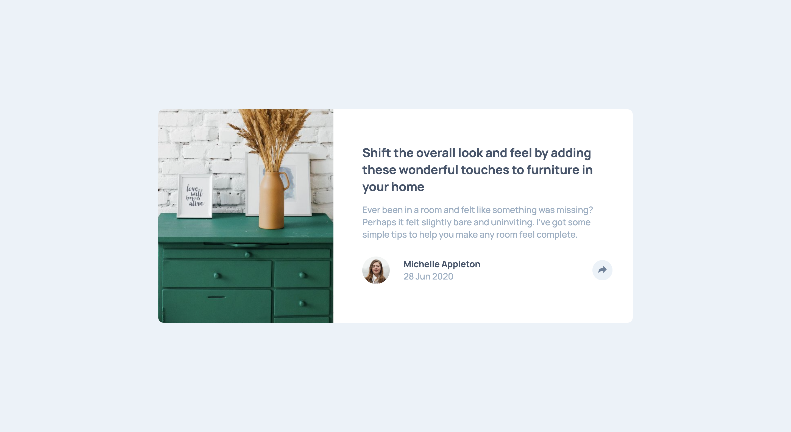
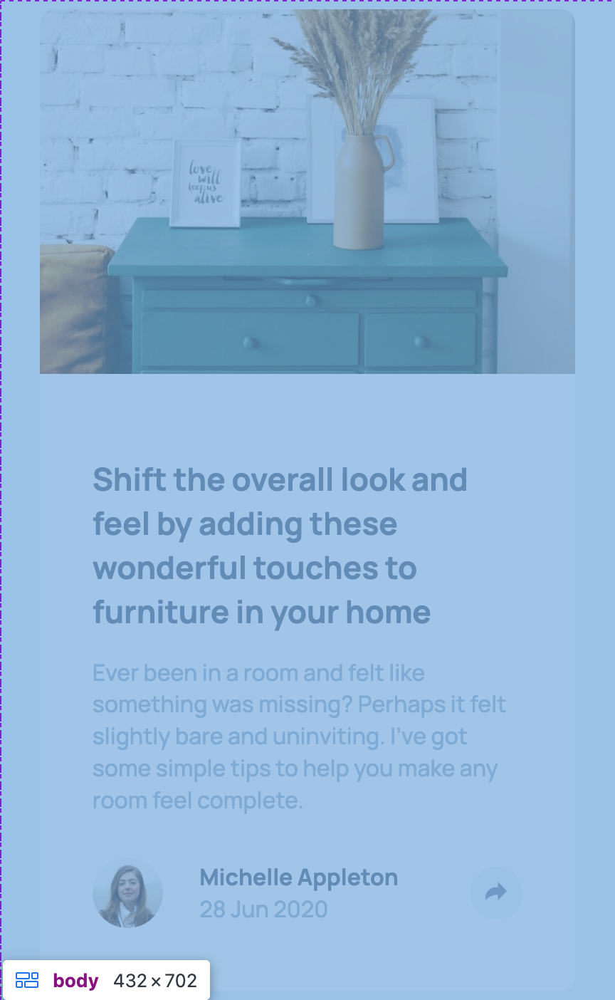

# Frontend Mentor - Article preview component solution

This is a solution to the [Article preview component challenge on Frontend Mentor](https://www.frontendmentor.io/challenges/article-preview-component-dYBN_pYFT). Frontend Mentor challenges help you improve your coding skills by building realistic projects. 

## Table of contents

- [Overview](#overview)
  - [The challenge](#the-challenge)
  - [Screenshot](#screenshot)
  - [Links](#links)
- [My process](#my-process)
  - [Built with](#built-with)
  - [What I learned](#what-i-learned)
  - [Continued development](#continued-development)
  - [Useful resources](#useful-resources)
- [Author](#author)

## Overview

### The challenge

Users should be able to:

- View the optimal layout for the component depending on their device's screen size
- See the social media share links when they click the share icon

### Screenshot




### Links

- Solution URL: [Github URL](https://github.com/lij110397/article-preview-component)
- Live Site URL: [Live solution](https://lij110397.github.io/article-preview-component/)

## My process

### Built with

- Semantic HTML5 markup
- CSS custom properties
- Flexbox
- CSS Grid
- Mobile-first workflow

### What I learned
**1. How to add HTML elements and styles using javascript**
1. Using innerHTML in javascript
- In this method, I structure the HTML in Javascript files and added it to the document using innerHTML this attribute.
- Advantage: It can add HTML when needed.
- Disadvantage: It makes the JS file too long.
```javascript
const shareHTML = `
    <div class="shareLeft">
        <p>SHARE</p>
        
        
        
    </div>
    <button class="component-author-share">
      <svg xmlns="http://www.w3.org/2000/svg" width="15" height="13" id="shareSVG">
      <path
        fill="#6E8098"
        d="M15 6.495L8.766.014V3.88H7.441C3.33 3.88 0 7.039 0 10.936v2.049l.589-.612C2.59 10.294 5.422 9.11 8.39 9.11h.375v3.867L15 6.495z"
      />
      <title>This is a share button</title>
      </svg>
    </button>`;
const sharePanel = document.createElement("div");
sharePanel.classList.add("sharePanel");
sharePanel.innerHTML = shareHTML;
sharePanel.classList.add("shareStyle");
```
2. Place the HTML in the HTML files, CSS in the CSS stylesheet:

We can include the HTML and CSS in advance in HTML and CSS stylesheet. And using Javascript only controls the display attribute of the elements.
In this way, separate CSS style classes in CSS files. In JS file, only add or remove the classes to control the style.
- Advantage: This method can define the HTML and CSS of extra content in advance. The presentation and the control logic are separated, which makes the code neat. 
```javascript
    socialPanel.classList.remove("hidden");
    authorPanel.classList.add("article-review-author_hidden");
```
The CSS style classes can change according to media queries and different states.
```css
/* The hidden here mean this css class is used in "hidden" state */
.article-review-body_hidden {
  margin-bottom: 0;
}
```

**2.  cannot change its fill using javascript (if i have to change the svg fill using javascript)**
To change the fill of a svg image, the svg image has to be inline.
If the svg is inside a  label, its fill cannot be changed by setting style.fill.
However, placing the style setting all in stylesheets may make this javascript file look better.
```html
<svg xmlns="http://www.w3.org/2000/svg" width="15" height="13">
  <title>Alternate Text</title>
  <path fill="#6E8098" d="M15 6.495L8.766.014V3.88H7.441C3.33 3.88 0 7.039 0 10.936v2.049l.589-.612C2.59 10.294 5.422 9.11 8.39 9.11h.375v3.867L15 6.495z"/>
</svg>
```
```javascript
  const shareSVG = shareButton2.querySelector("#shareSVG");
  const pathElement = shareSVG.querySelector("path");
  pathElement.style.fill = "hsl(210, 46%, 95%)";
```

### Continued development
**How To set the extra panel's position?**
- What I do:
I use absolute position in this case. I use javascript to calculate the position of the button and get panel's position accordingly. Then I set the panel's position using "top" and "left" attributes.
- What's the problem?
This means I have to do this action according to the screen's size since I only do this in larger screen. This may cause different media queries from those in CSS stylesheet.
In logic, it may be a better way to make the position relative, but how to do it?
```javascript
  if (window.innerWidth > 910) {
    const buttonRect = shareButton.getBoundingClientRect();
    const buttonX = buttonRect.left;
    const buttonY = buttonRect.top;
    //use the button position to set panel position
    socialPanel.style.position = "absolute";
    socialPanel.style.top = `${buttonY - 100}px`;
    socialPanel.style.left = `${buttonX - 150}px`;
  }
```
- **A better way: Set the parent container position relative and set child container position absolute according to its parent container**
```css
  .article-review {
    position: relative;
  }
    .article-review-socialpanel {
    position: absolute;
    top: 170px;
    right: -170px;
  }
```

**How Javascript adjust to responsive design? How javascript may use media Queries?**
It is a good idea to use media queries in javascript too? What will be a safer way to use media queries in javascript? What are the common scenarios?
If not using media queries, how to adjust js codes for different screen sizes just like in this case?
- What I do?
I put all CSS relative codes in CSS stylesheet including media queries. This means adjusting the styles of the extra panel in stylesheet only. 


### Useful resources

- [Extra way to reset CSS](https://www.joshwcomeau.com/css/custom-css-reset/)

## Author

- Website - Jiao Li